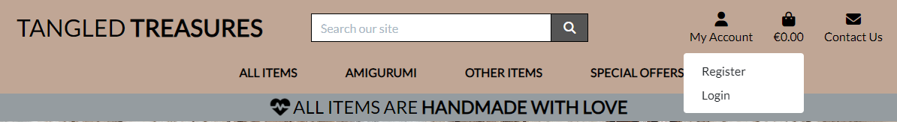
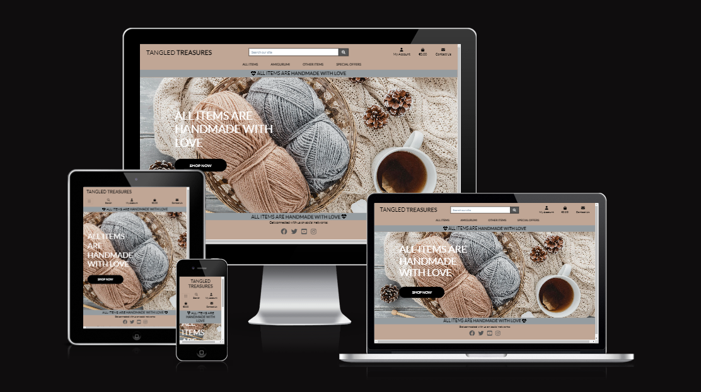
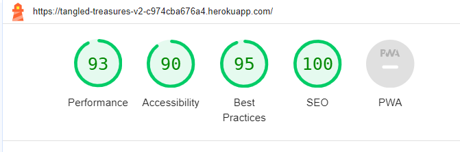

# Tangled Treasures

Welcome to Tangled Treasures!

View the live project here: [Tangled Treasures](https://tangled-treasures-v2-c974cba676a4.herokuapp.com/)

## Index – Table of Contents

* [User Experience (UX)](#user-experience-ux)
  * [User Stories](#user-stories)
* [Features](#features)
* [Technologies Used](#technologies-used)
* [Testing](#testing)
* [Deployment](#deployment)
* [Credits](#credits)

## User Experience (UX)

### User stories

The User stories can be found on [Tangled Treasures V2 User Stories](https://github.com/users/ValeP314/projects/8/views/1)

* US01: View site.
  * As a **Site User** I can **access the Home page** so that I can **understand the site purpose and decide if relevant to my needs**.
* US02: Pagination.
  * As a **Site User** I can **view a paginated lists of items** so that **I can select the item to view**.
* US03: View a list of items.
  * As a **Site User** I can **view a lists of items** so that **I can select an item to buy**.
* US04: Account registration.
  * As a **Site User** I can **register for an account** so that **I can have a personal account and save my personal information**.
* US05: Login and/or logout
  * As a **Registered Site User** I can **login and/or logout** so that **I can access my account information**.
* US06: Recoved password:
  * As a **Registered Site User** I can **recover access to my account** so that **I can easily retrieve my password**.
* US07: Email confirmation after registering.
  * As a **Registered Site User** I can **receive an email confirmation after registering** so that **I can verify that my account registration was successful**.
* US08: User profile.
  * As a **Registered Site User** I can **get a personalised profile page** so that **I can view my details and order confirmations**.
* US09: Sort the list of items.
  * As a **Site User** I can **sort the list of items** so that **I can identify the best rated, best priced and categorically sorted items**.
* US10: Add an item.
  * As a **Site Admin** I can **add an item** so that **I can add new items to my store**.
* US11: Edit/Update an item.
  * As a **Site Admin** I can **edit an item** so that **I can change product prices, descriptions, images and other info**.
* US12: Delete an item.
  * As a **Site Admin** I can **delete an item** so that **I can remove items that are no longer for sale**.

## Features

### Existing Features

* **Navigation Bar**
  
  * The Navigation bar will show the same main features, even though the User might be registered or not.
    
    * If the Site User is not Logged in, the "My Account" menu will prompt the opportunity to register or to login.
        
    * If the Site User is logged in, the "My Account" menu will includes links to the "My Profile" page and the Logout form.
        
    * If the Site User is a Superuser, there is also a link to the Product Management page.
        
    * Featured on all pages, the navigation bar is fully responsive, even on mobile.
        
  * This section will allow the user to easily navigate and sign In/Up to make use of the full website functionality, without having to revert back to the previous page.
* **The landing page image**
  * The Landing page includes a logo and a brand name, and helps the User to identidy the website.
    
* **The items list**
  * The items list is paginated and includes a picture and a name of the item, to allow the user to visualise the items sold on the platform.
  * The list can be ordered by price, rate and category, to help the User identifying the items that they might like.
    
* **The item details**
  * The item details page includes the picture and the name, and a short description of the items and the materials used.
    
  * Below, there is a list of reviews that have been added by registered Site Users.
  * If the Site User is not registered, there is a prompt to sign in/up, in order to review the items.
  * If the Site User is registered, they will be able to review items through a form.
* **The Admin functionalities**
  * The Admin will be able to add, edit and delete items directly through the webpage, without the need of accessing the admin site. They can do it from the Product Management menu:
  
  * or from the list of items:
  
  * or from the details page:
  
* **The Footer**
  * The footer section includes links to the relevant social media sites for Future Home. The links will open to a new tab to allow easy navigation for the Site User.
  * The footer is valuable to the user as it encourages them to keep connected via social media.
    
* **Sign Up/Register Form**
  * The "Sign Up" will provide the user with the opportunity to register to the website.
  * In case the Site User is already registered, it provides the option to Sign In instead.
  * This section is valuable to the user as they will be able to access the full website functionality.
    
  * The form collects the User username, an email address, and a password, that needs to be confirmed for registration purpouse.
    
* **Sign In Form**
  * The "Sign Up" will provide the user with the opportunity to sign up to the website.
  * In case the Site User is not already registered, it provides the option to Register instead.
  * This section is valuable to the user as they will be able to access the full website functionality.
  * The form collects the username and password only.
    
* **Logout Form**
  * This page will allow the Site User to log out.
  * After clicking the button, a second page will ask to confirm the intention to log out.
    

### Features Left to Implement

* A Favicon could be implemented to allow the User to easily identify the website if they have more than one tab open

## Technologies Used

### Languages

* [HTML5](https://en.wikipedia.org/wiki/HTML) - Provides the content and structure for the website.
* [CSS3](https://en.wikipedia.org/wiki/CSS) - Provides the styling for the website.
* [Python](https://en.wikipedia.org/wiki/Python_(programming_language)) - Provides the functionality for the site.

### Frameworks & Software

* [Github](https://github.com/)
* [Bootstrap](https://getbootstrap.com/)
* [Django](https://www.djangoproject.com/)
* [Gitpod](https://www.gitpod.io/)
* [Balsamiq](https://balsamiq.com/)
* [Heroku](https://en.wikipedia.org/wiki/Heroku)
* [AmIresponsive](https://ui.dev/amiresponsive)
* [Favicon](https://favicon.io/)
* [Google Chrome DevTools](https://developer.chrome.com/docs/devtools/)
* [Cloudinary](https://cloudinary.com/)
* [Canva](https://www.canva.com/colors/color-wheel/ )
* [HTML Validation](https://validator.w3.org/)
* [CSS Validation](https://jigsaw.w3.org/css-validator/)
* [Lighthouse](https://developer.chrome.com/docs/lighthouse/overview/)

## Testing

* I tested this page in different browsers: Chrome, Edge, Safari.
* The project is responsive, and it looks and works well on different browsers and screen sizes.
  

### Validator Testing

* Accessibility
  * Performance, accessibility and best practices were assessed through Lighthouse in devtools and passed the testing with good scores.
    
  * The Performance scoreis pretty good, but was improved converting the .png files in .webp files, in order to compress the images and facilitate the upload when the page is loaded.
  * Accessibility, best practices and SEO obtained great scores.

### Manual Testing

* Navigation Bar:
  * The navigation bar was modified to make it fully responsive. The collapsible menu was implemented for the mobile version, and icons and font-size were reduced on smaller screens in order to fit in one row.
  * All links were tested and worked well as expected.
* Home Page:
  * The icon in the banner pulses and was obtained from FontAwecome.
* Footer:
  * When clicked, the "Facebook" icon opens a new tab and redirects to www.facebook.com.
  * When clicked, the "Twitter" icon opens a new tab and redirects to www.twitter.com.
  * When clicked, the "YouTube" icon opens a new tab and redirects to www.youtube.com.
  * When clicked, the "Instagram" icon opens a new tab and redirects to www.instagram.com.
* List of items:
  * The list of items is fully responsive and displays 4 items on larger screens, 3 on medium screens, 2 on small screens and 1 on mobile devices. The feature has been tested for numerous screen sizes and works well.
* Search box:
  * The search functionality was tested searching for words included in the title (such as bag, toy, etc.) and included in the descriptions (such as cotton, wool, etc.).
  * The search functionality was tested for categories of items, making sure that they would all work.
  * Sorting functionality was tested for ascending and descending price, just modifying the URL, and they both worked.
  * Sorting by category was implemented and tested for ascending and descending alphabetical order, modifying the URL, and they both worked fine.
  * The number of items called at the beginning of the page list was tested at every search and sorting instance, and worked evry time.
  * The "Sort by" box was tested for each and every option, and they all worked fine.
  * The "Back to the top" button was afded to the list of items page, in oder to go back to the top of the page easily, without having to scroll through hundreds of items. It was tested on numerous searches and sorting instances, and it always worked well.
* Shopping bag:
  * Functionality to add/remove items was added and tested multiple times successfully.
  * When adding an item, a success message pops up, to show that the toasts work fine.
  * When removing an item, a success message pops up, to show that the toasts work fine.
  * The toast message shows a preview of the shopping bag successfully.
* Checkout:
  * The checkout page was updated after adding or removing items several times, and it worked well as expected.
* Payments:
  * Stripe was installed and payments were checked printing "intent" to prove that the form was submitted.
  * I noticed when checking out that the email address for the confirmation email didn't come up on the checkout_success page. I checked the code and noticed that there was an interruption of the line occourred authomatically through the editor, set to authomatically format pasted content. The issue was easily rectified; another order was submitted and the email address appeared on screen.
  * The order page was accessed from the admin page, and I made changes to multiple order to make sure that the total and the delivery charges would update correctly. Every attempt was successful.
  * The checkout_page was updated to reflect order details, and it worked well. Some prices displayed in dollars instead of euros, so I substituted the dollar symbol with the euro symbol.
  * The checkout_success page was tested on different size devices and was fully responsive.
  * The spinning loading overlay was added and tested. It worked after an hard refresh, and it displayed the authentication when the card 4000002500003155 (requiring further authentication) was used.
  * The authentication was checked: if failed, the checkout bag would reload containing the information already filled except for the credit card details, with a message stating that the payment was not successful. In this way, the customer doesn't have to re-fill all fields. The authentication was then confirmed, and the payment was successful.
  * Webhooks were implemented and were checked sistematically to make sure everything was working fine.
  * Multiple purchases/payments were put through to make sure that the webhooks were all working after identified bug (then fixed, see below).
  * Confirmation emails were set up and tested on the console. The template was displayed nicely and it worked fine.
* Profile page:
  * The Profiles app was created and the webpage loaded fine when accessing from the url in early stages of development.
  * The profile page was updated to reflect the username, and it worked fine.
  * When making a purchase, it is possible to save the address, phone number and all relevant info clicking on a checkbox. The featuee has been tested deleting all info and then selecting the box, and the address was updated.
  * The order history displays a list of all orders, showing order number, date, items and total price. There is a link in the order number that brings back to the full success page that displays all info, and works fine.
  * When attempting a new order, the info saved are displayed in the form correctly. I tested many changes, and they were all updated promptly.
* Product Management:
  * The Product Management page was created and tested using prices with more than 6 figures, or items with or without a picture. Ano_image picture was uploaded onto the media folder to account for items without a picture.
  * The editing functionality was tested modifying every parameter in existing items, and then editing them back. The validations worked fine for prices with more than 6 figures.
  * The delete item functionality was tested adding a new item and then deleting it from the Product Management page. The success message displayed correctly and the item was deleted promptly.
  * When editing an item picture, the widget allows to upload a new picture from the pc.
  * The delete picture functionality was tested checking the relevant box and removing the picture associated with the item, and loading a new one then.
* Security:
  * I tested the website security trying to access the admin platform when not logged in, and I wasn't able to access the interface as expected.
* Newsletter:
  * Mailchimp was setup and tested, and worked well:
    
* Facebook page:
  * A Facebook page was created and linked in the footer:
    
    

### Fixed Bugs

* The project had to be start from scratch, due to an issue with the payments. The original project was modified and reverted back to previous commits in order to fix the issue, but in the end some crucial code was lost and it was easier to start again, using the code already written up on verison 1. That repository is still accessible here [PP5 - Tangled Treasures](https://github.com/ValeP314/pp5-tangled-treasures/tree/main).
* I noticed than the container-fluid in the items.html was a bit overlayed on smaller screens and fixed the issue added a margin-top spacing to the HTML.
* The search box didn't work as the friendly name was used instead of the name of the categories. It was easy to rectify the names and fix the bug.
* I had a bug with the checkout view, as the calc_subtotal would not being found even though calculated in the checkout app. I realised the same function was working in the bag app, so I compared quickly the 2 apps and realised I hadn't loaded the "bag_tools" on the checkout.html file. The page worked well after loading that file.
* The webhooks didn't work properly when I first included them. I did some research and found a conversation on Slack about making port 8000 public. When I made the change, the webhooks started working.
* The payment_intent.succedeed webhook failed for an internal Sever Error (status 500). After comparing the code with Boutique Ado walk-through and checking on Slack, I realised I had never imported Stripe on the webhook_handler.py file.
* In the Profile page, the country field was updated in order to display as grey when not selected. The JS file didn't seem to work, so I checked and compared the code without finding the mistake. In the end, I noticed the countryfield.js file was in the static/profiles folder, instead of the static/profiles/js folder. It was iasy to migrate the file inside rhe relevant folder: when tested, the feature worked fine.  
* While testing the profile page and attempting to update address or other details, I noticed that the success message also contained the shopping bag (if not empty). To fix that I included another context variable and then updated the success message so to exclude the shopping bag on the profile page.
* When editing an item, I noticed that an error message would display instead of an info or warning message, so I changed it to warning instead. Later on, I found that the toast_info.html file contained a warning message instead of an Info message, so I changed it to clear the previous bug.
* When adding the widgets, I got an error stating that the items/custom_widget_templates/custom_clearable_file_input.html didn't exist. Checking the location of the custom_widget_templates folder, I realised that it should have been inside the items folder, so I moved it and the widget worked fine.
* Issue with pictures not formatted (all different sizes): the problem was fixed through CSS.
* Issue with footer not anchored at the bottom of the page. I added the class container-fluid and fixed it through CSS.
  
### Unfixed Bugs

* Issue with Shopping bag as per shopping bag video. Implementation suggested in the video but not performed.
* There is no confirmation page for deleting items, it might be implemented.

## Deployment

The live link can be found here - [Tangled Treasures](https://tangled-treasures-v2-c974cba676a4.herokuapp.com/)

### Deployment to Heroku
1. Create an account or log in to [Heroku](https://www.heroku.com/).
2. On the dashboard, click on "New" and select "Create new app".
3. Give the app a unique name and select the region closest to you. Then click "Create app" to confirm.
4. To create a new database that can be accessed by Heroku, create an account or log in to [ElephantSQL](https://customer.elephantsql.com/login).
5. Click "Create New Instance".
6. Set up your plan, giving it a name and choosing the "Tiny Turtle (free)" plan.
7. Select the Region and data center closer to you, and then click "Review" and confirm clicking on "Create instance".
8. Return to the ElephantSQL dashboard and click on the database instance name for this project.
9. In the URL section, click the copy icon to copy the database URL.
10. Install the plugins dj-database-url and psycopg2-binary in terminal.
11. Run pip3 freeze > requirements.txt so both are added to the requirements.txt file
12. Create a Procfile in the root directory, adding `web: gunicorn yourapp.wsgi:application`.
13. Run the migration command in your terminal to migrate your database structure to the newly-connected ElephantSQL database: `python manage.py migrate`
14. Run "python3 manage.py createsuperuser" to create a superuser.
15. Load the .json files for categories and items.
16. Install gunicorn (pip install gunicorn) and add it to the requirements.txt file using the command pip3 freeze > requirements.txt
17. In ALLOWED_HOSTS, add the Heroku app and localhost to the list: `ALLOWED_HOSTS = ['HEROKU_APP_NAME.herokuapp.com', 'localhost']`
18. Add a config variable typing `DISABLE_COLLECTSTATIC = 1`.
19. Connect heroku to the Github repository and allow authomatic deploys.
20. Deploy the app, and access the website.

### Stripe
1. Register for a Stripe account.
2. in the Developers section, click on the API section and copy the publishable and secret keys.
3. Add STRIPE_PUBLIC_KEY and STRIPE_SECRET_KEY to settings.py and to Heroku, using the values found in the API section.
4. access the webhooks section and create a webhook.
5. Choose all events to be visualised and add endpoint.
6. Add the STRIPE_WH_SECRET variable to the environment and to Heroku.

### AWS 
1. Register for a AWS Management Console account.
2. Access S3 and create a bucket.
3. Set up parameters and authorisation to the bucket properties (static hosting property, CORS and bucket policy).
4. Access IAM and create a group.
5. Create a Policy for the group.
6. Create a User and link the three.
7. Download a csv file from the User page, that contains the user access key and the secret access key.
8. Install boto3 and django storages, and freeze the requirements.txt file.
9. Add the AWS variables to settings.py, to connect the static storage space to the app.
10. Create a media folder, to store all media into AWS.

### Forking the Repository
Forking creates your own copy of another existing repository in the remote location.
In order to fork this repository:
1. Locate the [Tangled Treasures](https://github.com/ValeP314/pp5-tangled-treasures-v2) repository on GitHub.
2. Select "Fork" on the top right side of the page.
3. A copy of the repository will be saved on your GitHub account.

### Cloning the repository
Cloning makes a local copy of a repository, and retains a link to its original repository. If you would like to make changes directly to a repository you have the permission to contribute to, then cloning will be the first step before we implement the actual changes and push.
1. Locate the [Tangled Treasures](https://github.com/ValeP314/pp5-tangled-treasures-v2) repository on GitHub.
2. Click on the "Code" menu and select one of the cloning options: HTTPS, SSH, and GitHub CLI, copying the link provided.
3. Open a Terminal.
4. Change the current working directory to the location where you want the cloned directory.
5. Type `git clone`, and then paste the URL you copied earlier (in step 2).
6. Press "Clone" and a new clone will be created.

## Credits  

### Content

* The main structure and the README file are inspired to the I Think Therefore I Blog and Boutique Ado projects.
* [W3 School](https://www.w3schools.com/), [StackOverflow.com](https://stackoverflow.com/) and [Slack](https://slack.com/intl/it-it/) were consulted regularly for tips on general coding.
* I searched for other PP5 projects on GitHub, to make sure I was working in the right direction.
* Some features, models and styling were inspired by my previous Project Portfolio PP4 [Future Home](https://future-home.herokuapp.com/)

### Images

* The [homepage](./media/homepage.webp) image was taken from Freepik (<https://www.freepik.com/free-photo/top-view-tea-mug-yarn-basket-with-pine-cones_11630959.htm#page=2&query=crochet&position=33&from_view=search&track=sph>).
* The pictures used for the various items, were taken from Freepik, Pixabay, Pexels and Vecteezy.
* The [icon]() image was taken from Vecteezy (<https://www.vecteezy.com/free-vector/crochet>).
* The icons were taken from [Font Awesome](https://fontawesome.com/)
* The [mockup](./docs/readme_docs/responsiveness.png) was simulated using [AmIResponsive](https://ui.dev/amiresponsive)
* The colours for the form were selected through [Coolors](https://coolors.co/) based on the homepage picture.

### Disclaimer

The information provided on this site is intended for educational purposes only.
